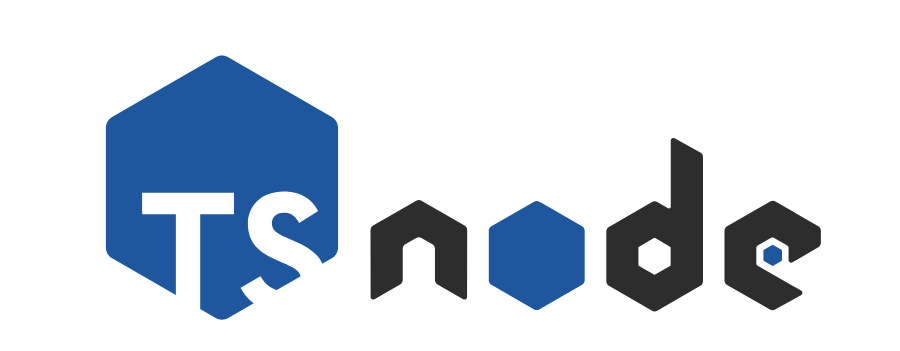

<!-- PROJECT LOGO -->
<br />
<p align="center">
  <a href="#">
    
  </a>

  <h3 align="center">Nodejs-Typescript/GraphQL/Express/MongoDB Boilerplate</h3>

  <p align="center">
    Eklavya Server is a REST API built using Node-Typescript/Express/MongoDB with JWT support.
    <br />
    This project is hosted on heroku at <a href="https://eklavya-server.herokuapp.com/API/documentation" target="_blank"> <b>eklavya-server.herokuapp.com/</b> </a>.
    <br />
    Frontend can be found at <a href="https://github.com/jaisoneji/eklavya-client" target="_blank"> <b> https://github.com/jaisoneji/eklavya-client </b></a>
    <br />
    <br />
    <a href="https://documenter.getpostman.com/view/9636093/T1DpDdHt?version=latest">📝 API Documentation</a>
  </p>
</p>

## Tech Stack


* [Node.js](https://nodejs.org/en/), [TypeScript](https://www.typescriptlang.org/) , [JWT](https://jwt.io/), [Prettier](https://prettier.io/)— core platforms.
* [GraphQL](https://graphql.org/), [express-graphql](https://github.com/graphql/express-graphql)- schema and Graphql API endpoint.
* [MongoDB](https://www.mongodb.com/) — data access and db automation.
* [Jest](https://jestjs.io/) - unit and snapshot testing.


## Development

We use `node` version `10.15.0`

```
nvm install 10.15.0
```

```
nvm use 10.15.0
```

The first time, you will need to run

```
npm install
```

Then just start the server with

```
npm run start
```
It uses nodemon for livereloading ✌️

<!-- LICENSE -->
## License

Distributed under the MIT License. See `LICENSE` for more information.
